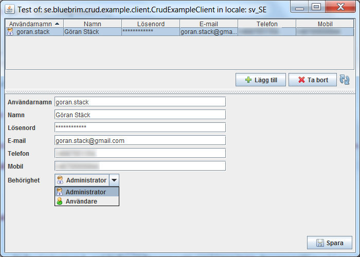

=  JFreeCRUD
:toc: left
:icons: font
:sectnums:

JFreeCrud is a framework for creating three tier client server CRUD applications that runs on JSE.
Spring JDBC layer is used on top of JDBC for persistance in RDBMS. Spring Remote is used for communication
between clients and server.

.Screen dump of an automatic meter reading system based on JFreeCrud
image::site/images/window-menu.png[]

The JFreeCRUD project is a client server framework and applications that are built based on JFreeCRUD are deployed as two separate artifacts one for the server side and one for the client side. But by using Java Web Start its possible to include the client artifact in the the server distribution and only distribute an Internet short cut to the clients. The short cut locates a JNLP file that is served by the embedded web server in the JFreeCRUD server.

Server side
This component contains the server side part of JFreeCRUD. To use it include the following in your pom.xml:

----
se.bluebrim se.bluebrim.crud.server
----

Client side
This component contains the server side part of JFreeCRUD. To use it include the following in your pom.xml:

----
se.bluebrim se.bluebrim.crud.client
----

To try an example based on JFreeCRUD include the server and client part of the example in your pom.xml:

[source,XML]
----
<dependency>
    <groupId>se.bluebrim</groupId>
    <artifactId>se.bluebrim.crud.example.server</artifactId>
    <version>1.x.x</version>
</dependency>
    <dependency>
    <groupId>se.bluebrim</groupId>
    <artifactId>se.bluebrim.crud.example.client</artifactId>
    <version>1.x.x</version>
 </dependency>
----

Due to a bug in in `com.carbonfive.db.migration.ResourceMigrationResolver` line: 84 its not possible to embed db migrations files in
jar files. Line 84 tries to filter out directories by calling Resource.getFile(). If the resource is a part of jar file an exception
is thrown.

A workaround is to copy the file: `20080115200312_create_users_table.sql` from inside the jar file:
`se.bluebrim.crud.example.server-1.x.x.jar` and put it in a resources folder under `db/migrations/`.
Make sure that the file are copied to the target folder before running. I have experienced problems when using m2eclipse that
the resource files don't get copied.

Start the server by running the class: `se.bluebrim.crud.example.server.CrudExampleServer`. Start a client by running:
`se.bluebrim.crud.example.client.CrudExampleClient`. Edit users in the master detail window.

'''
++++
<small>

Project logo from <a href="http://www.artistsvalley.com/database-free-icons.html">http://www.artistsvalley.com/database-free-icons.html</a>

</small>
++++
